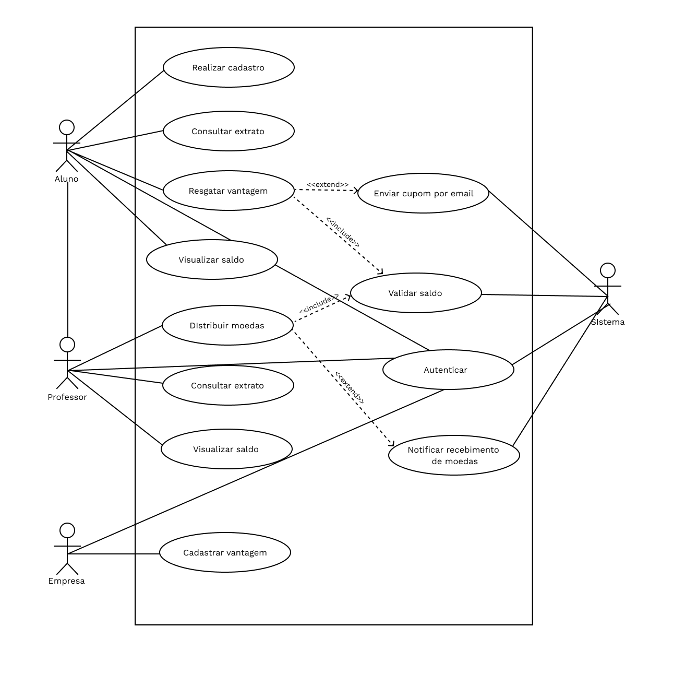

# Educoin ProjetoDeSoftware

Este projeto foi desenvolvido para a matéria de Projetos de Software, do curso de Engenharia de Software da Pontifícia Universidade Católica de Minas Gerais. Se tratando do desenvolvimento de um sistema de moedas estudantil voltado para professores e alunos.

---

## Diagrama de casos de uso

---

## Histórias de usuário

| Usuário            | Necessidade                                           | A fim de                                               |
|--------------------|------------------------------------------------------|-------------------------------------------------------|
| Aluno              | me cadastrar no sistema                              | participar do programa de reconhecimento de mérito e receber moedas. |
| Administrador      | cadastrar professores no sistema                     | que eles possam distribuir moedas aos alunos.         |
| Professor          | distribuir moedas para meus alunos                   | reconhecer seu bom desempenho e participação nas aulas.|
| Aluno              | receber uma notificação por email quando eu receber moedas | saber que fui reconhecido.                            |
| Aluno              | consultar meu extrato de moedas                      | acompanhar quantas moedas tenho e como as utilizei.   |
| Aluno              | trocar minhas moedas por vantagens cadastradas       | usufruir de descontos e produtos oferecidos pelas empresas parceiras. |
| Empresa Parceira    | cadastrar vantagens no sistema                       | que os alunos possam trocá-las por moedas e aumentar a visibilidade da minha empresa. |
| Aluno              | receber um email com um cupom após resgatar uma vantagem | utilizá-lo na troca presencial.                       |
| Usuário (Aluno/Professor) | realizar o login no sistema com meu email e senha | acessar minhas informações de forma segura.          |
| Professor          | consultar o histórico de transações de moedas que realizei | acompanhar como e para quem distribui as moedas.     |

---

## Diagramas de classes

---

## Diagramas de componentes

---

## Links uteis 
[Diagrama de Classes (Figma)](https://www.figma.com/community/widget/1223307422838321651)
[Diagrama de Caso de Uso (Figma)](https://www.figma.com/community/file/986330591099819762/uml-use-case-diagram)

